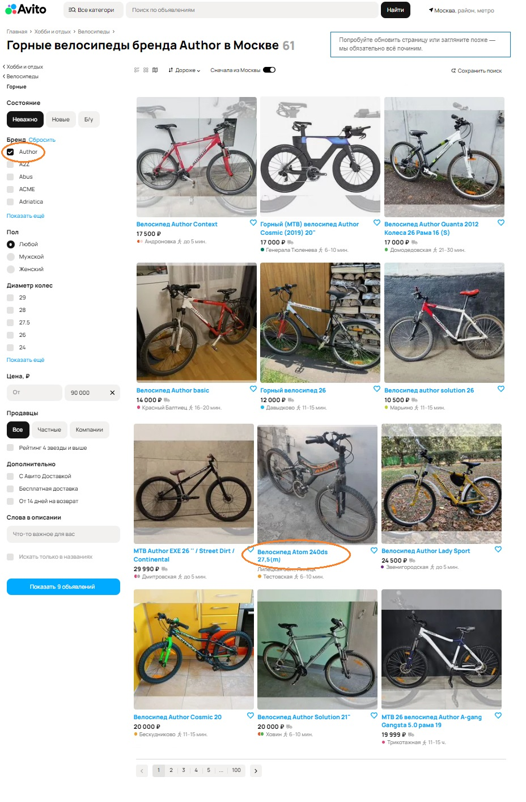

### **1. Неверный подсчет результатов в заголовке**  
**Элемент:** Заголовок  
**Описание:** Количество результатов в выдаче не соответствует подсчитанным результатам в заголовке. Действительное количество результатов неизвестно, так как в заголовке, фильтре и пагинации разные числа.
**Приоритет:** Medium  
**Аргументация:** Ошибка влияет на доверие пользователей, но не блокирует основные функции. Несоответствие между заголовком и результатами может вызвать путаницу, но система остается функциональной.  
**Исправление:** Проверить алгоритм подсчета результатов и синхронизировать данные между заголовком и выдачей. Добавить автоматическое обновление заголовка при изменении результатов.

---

### **2. Неверный подсчет результатов в фильтре**  
**Элемент:** Фильтр  
**Описание:** Количество результатов в выдаче не соответствует подсчитанным результатам в фильтре. Действительное количество результатов неизвестно, так как в заголовке, фильтре и пагинации разные числа.
**Приоритет:** Medium  
**Аргументация:** Аналогичен предыдущему, но касается фильтра. Проблема не критична, так как фильтр частично работает.  
**Исправление:** Проверить логику фильтрации, убедиться, что счетчик учитывает только актуальные результаты. Внедрить тесты для проверки корректности подсчета. Синхронизировать данные между заголовком, фильтром и выдачей

---

### **3. Неверный подсчет в пагинации**  
**Элемент:** Пагинация  
**Описание:** Количество результатов в выдаче не соответствует пагинации. Действительное количество результатов неизвестно, так как в заголовке, фильтре и пагинации разные числа.  
**Приоритет:** High  
**Аргументация:** Пагинация — ключевой элемент навигации. Ошибка приводит к некорректному разделению данных, что делает интерфейс неудобным. При выделенных 100 страницах создается путанница в отображаемых данных.  
**Исправление:** Пересмотреть логику пагинации: проверить расчет общего количества страниц и распределение элементов. Убедиться, что параметры пагинации передаются корректно. Синхронизировать данные между заголовком, фильтром, пагинацией и выдачей

---

### **4. Фильтр по бренду показывает неверные товары**  
**Элемент:** Фильтр  
**Описание:** В выдаче присутствует товар бренда, который не соответствует выбранному в фильтре  
**Приоритет:** High  
**Аргументация:** Фильтрация — основная функция для пользователей. Ошибка подрывает доверие и делает фильтр бесполезным.  
**Исправление:** Проверить связь между выбранным брендом и запросом к базе данных. Добавить валидацию фильтров на стороне сервера.

---

### **5. Фильтрация по городу работает некорректно**  
**Элемент:** Локация  
**Описание:** В выдаче присутствует товар из города, который не соответствует выбранной локации  
**Приоритет:** High  
**Аргументация:** Локация важна для пользователей. Ошибка может привести к нерелевантным результатам.  
**Исправление:** Убедиться, что геоданные товаров/услуг актуальны. Проверить API-запросы фильтрации.

---

### **6. Фильтр по категории показывает несоответствующие товары**  
**Элемент:** Фильтр  
**Описание:** В выдаче присутствует товар, несоответствующий категории  
**Приоритет:** High  
**Аргументация:** Категории — базовая часть навигации. Ошибка делает систему ненадежной. Выдача нерелевантных результатов затрудняет поиск. 
**Исправление:** Проверить присвоение категорий товарам и работу фильтра. Внедрить тесты на корректность отображения товаров после фильтрации.

---

### **7. Сортировка по цене сбивается после 6-го результата**  
**Элемент:** Сортировка  
**Описание:** Сортировка сбивается после 6-го результата  
**Приоритет:** High  
**Аргументация:** Сортировка — ключевая функция. Ошибка делает ее бесполезной для больших наборов данных.  
**Исправление:** Проверить алгоритм сортировки и пагинации. Убедиться, что данные не кэшируются некорректно или не перезаписываются.

---

### **8. Фильтр по цене "до 90 000" показывает товары дешевле**  
**Элемент:** Фильтр  
**Описание:** При ценовом фильтре "до 90 000" максимальная цена товара на странице, отсортированной по убыванию цены, составляет 29 990, уверена, что есть товары дороже, вплоть до граничной цены. Возможно, сбитие сортировки зависит от выбранного диапазона цены.
**Приоритет:** High  
**Аргументация:** Ценовой фильтр критичен для пользователей. Ошибка вводит в заблуждение и нарушает ожидания.  
**Исправление:** Проверить логику фильтрации совместно с сортировкой. Исправить условие в коде и протестировать с разными диапазонами.

---

### **9. Ошибка в названии станции метро**  
**Элемент:** Название станции метро  
**Описание:** Название станции написано с ошибкой, вероятно подразумевалась станция "Ховрино" вместо "Ховин"  
**Приоритет:** High  
**Аргументация:** Ошибка в данных снижает доверие к платформе и может привести к путанице.  
**Исправление:** Проверить базу данных на наличие опечаток. Реализовать автоматическую проверку названий через справочник станций.

---

### **10. Некорректное отображение пути в категории**  
**Элемент:** Путь  
**Описание:** Отображение пути до категории не соответствует действительности  
**Приоритет:** Low  
**Аргументация:** Проблема влияет на UX, но не блокирует функциональность.  
**Исправление:** Исправить отображение пути, используя актуальные данные категорий. Добавить проверку иерархии категорий при генерации пути.

---

### **11. Неверный формат отображения выдачи**  
**Элемент:** Формат отображения  
**Описание:** Выдача отображается в виде сетки при выбранном способе отображения - на карте  
**Приоритет:** Medium  
**Аргументация:** Ошибка влияет на UX, но не нарушает функциональность.  
**Исправление:** Проверить условия переключения между режимами "сетка" и "карта". Убедиться, что настройки сохраняются и применяются корректно. Возможно достаточно поменять местами иконки режимов, если их перепутали

